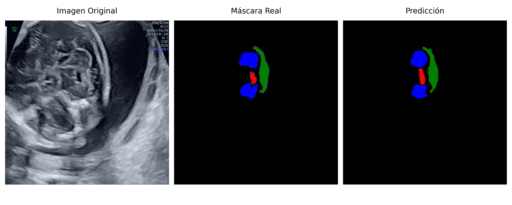

# Segmentación automática de estructuras cerebelosas en ecografías fetales
**Autora:**: Eira Rodríguez Martín

**Tutores**: 
- Pedro Latorre Carmona
- Roberto Martínez-Guisasola Guerrero
---
Este proyecto implementa una aplicación para la segmentación automática de estructuras cerebrales fetales en ecografías 2D, en particular, las estructuras cerebelosas (como el cerebelo, vermis cerebeloso y cisterna magna). Utiliza técnicas de deep learning mediante redes neuronales convolucionales, entrenadas con imagenes clínicas reales y anotaciones en formato COCO. 

La solución incluye una interfaz gráfica interactiva basada en Streamli, diseñada para facilitar su uso por parte de profesionales médicos sin necesidad de conocimientos técnicoa avanzados. Esta herramienta permite cargar ecografías, visualizar las segmentaciones generadas automáticamente y generar informes clínicos en PDF.

# Ejemplo de resultados
A continuación se muestra una comparación visual de los resultados obtenidos  por el modelo U-Net:


---
# Uso de la interfaz
## Acceso rápido
El usuario deberá abrir un navegador web y acceder a la aplicación mediante el siguiente enlace: 
- https://fetalbrainsegmentation.streamlit.app/
Una vez que la página haya cargado, la interfaz principal de la aplicación estará disponible para su uso inmediato.

## Instalación y ejecución local
Para ejecutar la aplicación o las funcionalidades del proyecto localmente en otro ordenador, el usuario deberá seguir los siguientes pasos:
### Clonar el repositorio del proyecto desde GitHub: 
**Nota**: Asegurate de tener [Git](https://git-scm.com/downloads) instalado en tu sistema.
```bash
git clone https://github.com/eirarodriguez /fetal_brain_segmentation.git
cd fetal_brain_segmentation
```

### Instalar Python:
Se debe tener Python 3.8 o superior instalado. Puedes descargarlo desde:  
[https://www.python.org/downloads/](https://www.python.org/downloads/)

### Crear un entorno virtual (opcional pero recomendado)
Esto permite aislar las dependencias del proyecto:
```bash
# En Linux/macOS
python -m venv venv
source venv/bin/activate
# En Windows
python -m venv venv
.\venv\Scripts\activate
```

### Instalar las dependencias
Una vez activado el entorno virtual, ejecuta:
```bash
pip install -r requirements.txt
```

### Ejecutar la aplicación localmente con Streamlit
Desde la raíz del proyecto:
```bash
streamlit run app.py
```
Esto abrirá la aplicación en tu navegador en: [http://localhost:8501](http://localhost:8501)

### Ejecutar scripts de entrenamiento
En la carpeta `Ejemplos/` se incluyen scripts de entrenamiento con distintas configuraciones.

#### Opción A: Google Colab

- Sube el notebook correspondiente a Colab.
- Añade el archivo `Informe.docx`.
- Ejecuta las celdas una por una.
  
#### Opción B: Entorno local
Ejemplo desde la terminal:
```bash
python Ejemplos/early_stopping_unet.py
```
Este comando ejecutará el pipeline completo: entrenamiento, evaluación y generación del informe.

#### Aclaraciones importantes
- Los scripts están adaptados para Google Colab (con comandos como `!pip install` o rutas `/content/`).  
  Si los ejecutas en local:
  - Elimina los comandos exclusivos de Colab.
  - Ajusta las rutas de acceso a archivos.
- Por motivos de privacidad, **no se proporciona la clave API de Roboflow**.  
  Si deseas usar tus propios datos, crea un conjunto en Roboflow y expórtalo en formato **COCO**.
